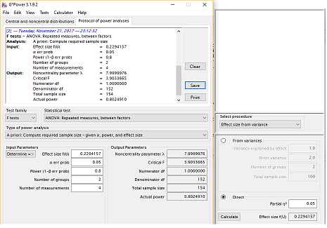
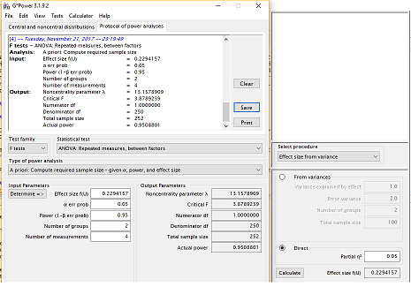
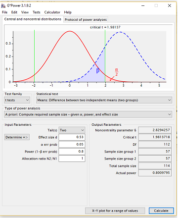
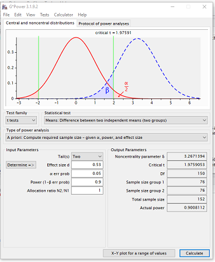
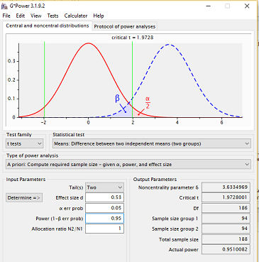
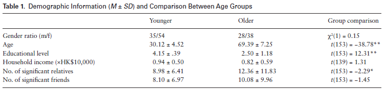
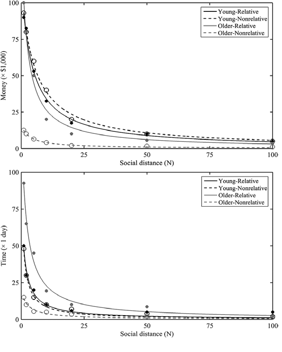
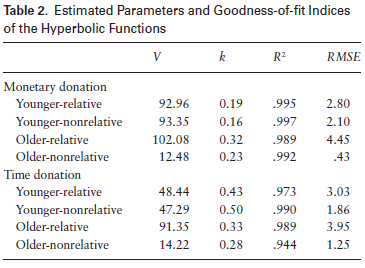

##Introduction

  Socioemotional Selectivity Theory (SST- Carstensen, 2006) postulates that due to a sense of limited time left in life older adults are motivated to engage with meaningful activities over ones that might provide future benefits. Yet, despite being thought of as a meaningful activity (Greenfield & Marks, 2004), older adults do not volunteer in higher rates compared to younger cohorts (U.S Bureau of Labor, 2015). The relatively low volunteer rates among older adults is especially surprising since laboratory experiments found that older adults show more prosocial behaviors compared to younger adults, and are more concerned with the wellbeing of others in need (Sze, Gyurak, Goodkind, &  Levenson, 2012; Beadle, Sheehan, Dahlben, & Gutchess, 2013;  Hubbard, Harbaugh, Srivastava, Degras, & Mayr, 2016)

  The study I attempt to replicate by Gong, Zhang, & Fung (2017) provides a possible explanation for this apparent discrepancy. In a hypothetical donation task, Gong and colleagues asked younger (N=89) and older (N=66) Hong Kong Chinese community membersto indicate how much money and time they are willing to donate to a person in need, with this person being progressively more socially distant to them. They found: a *weak qualified* main effect ($\eta_p^2$=0.05) of age such that older adults were less generous than younger adults when averaging across donation (money or time) and kinship (relative or non-relative) types. However, they found a 3-way Age group X Donation X Kinship interaction showing that *when donating their time to relatives, older adults were more generous than younger adults*. This post-hoc test had a medium effect size (*Cohen's D*=`r round(((2*3.22)/sqrt(145)),2)`, calculated based on reported t-statistic of $t_{(145)}$=3.22). **the qualified main effect of age group and the post-hoc test suggesting that older adults are more generous than younger adults when donating time to relatives are the two target findings for this replication**. 
  
  In addition, their post-hoc comparisons revealed that older adults, compared to younger adults, were less generous to non-relatives in monetary donations but the groups did not differ in generousity towards relatives in this donation condition. In contrast, older adults were less generous than younger adults when donating time to non-relatives (but were more generous to relatives as noted above). 
  
  Gong, Zhang and Fung were also interested in comparing the social discount rate of older and younger adults in each of the conditions. They found no main effects of social discounting, and an Age group X Donation type interaction. Post-hoc tests revealed that older and younger adults' social discount rates did not differ when donating time, and that compared to younger adults older adults had higher discount rates when donating money to relatives and non-relatives alike. They conclude that their findings regarding donation amounts and social discount rates are in accord with SST- older adults are affected more than younger adults by kinship and degree of social closeness, though these effects depend on the context of giving.

##Methods

###Power Analysis
In total, within each of the two age groups (younger- those aged 35 and under, and older adults- people aged 60 and older), each participant is providing `r 7*2*2` measures: for each of seven targets (of varying social distances) participants indicate how much money and time they are willing to donate. They report this for both relatives and non-relatives. Howere *these measures are NOT the vaules on which the analysis is run*. These values are used to computed group and individual hyperbplic discount curves of which *AUC* values represent a person's overall donation, and $\kappa$ values reflect a person's discount rate. This procedure results in each participant having 4 *AUC* values and 4 $\kappa$ values: one for each of the donation X kinship conditions. 

The original authors ran their analyses using a mixed (within/between subjects) ANOVAs, where age group was a between subject variable, and donation form and kinship were within subject variables. The dependent variable in the first ANOVA was the log-transformed Area Under the Curve (*AUC*) obtained after fitting a hyperbolic discount curve to individuals donation data. This area represents the total amount participants are willing to donate in each of the four donation form X kinship conditions. 


Upon finding a 3-way interaction between age group, donation form and kinship, the authors conducted post-hoc test and found that when donating their time to relatives, older adults were more generous than younger adults. **This mixed design repeated measure ANOVA of AUC values is the main interest for the purpose of this replication, with the post hoc test comparing older and younger adult's AUC values when donating time to relatives**

The original effect sizes of interest were: $\eta_p^2$=0.05 for the qualified main age group effect effect, and *D*=`r round(((2*3.22)/sqrt(145)),2)` for the post-hoc t-test on generosity of time donations for relatives. 

**Replication would be considered successeful if older adults are found to be ststistically more generous than younger adults when donating time to relatives, in a post-hoc *one-tailed* t-test. That is, if the mean *AUC* value for older adults in the time donation X relative condition is higher than that of younger adults** 

Power analysis using G*Power version 3.1.2.9 suggested that in order to obtain 80%, 90% and 95% power for the main effect of age, the required sample sizes are 154, 204, and 252 respectively. Details can be found here:

**Age group main effect- 80% power**



**Age group main effect- 90% power**


**Age group main effect- 95% power**

 

In order to obtain 80%, 90%, and 95% power to observe the stronger effect of age group on generosity in time donations to relatives (Older>Younger), requires sample sizes of 114 (57 per group), 152 (76 per group), and 188 (94 per group) respectively. Details can be found here:

**age group time donations, relatives- 80% power**




**age group time donations, relatives- 90%** 




**age group time donations, relatives- 95%** 



**Feasability-** Pliot participant completed the task in about 10 minutes. In light of the required sample sizes shown above, acheiving even 80% power for a two-tailed test would require too large a deviation from the proposed budget. To keep the cost within this project's budget, the replication study was powered to observe the stronger effect, that of older adults being more generous in time donation to relatives compared to young adults, to 80% in a *one-tailed* test.

###Planned Sample

The above mentioned power calculation suggests that a sample consisting of **45 older adults** (aged 55 or older), and **45 younger adults** (aged 35 or younger) suffices to achieve 80% power to detect the effect of interest in a one-tailed test (see below). As a note, this is equvilant of having 70% power to observe the effect in a two-tailed test. 

We relied on Amazon's mechanical Turk for data colelction, and sample only U.S residents to minimize the chance that participants do not read English. Further, older participants were recruited using the premium qualifications to speed-up data collection and avoid spending a large portion of the budget on non-qualifying participants taking the screener survey.


###Materials

In this study, age group is treated as a between subjects independent variable. Participants in both age groups completed the same experimental task. At first, the were given the following instruction:

> "The following task asks you to imagine that you have a list of 100 relatives (or non-relatives) arranged in descending order of their closeness with you. The person at position #1 is your closest relative (or non-relative), while the person at position #100 is a relative (or nonrelative) you may know but are not close at all. You do not have to actually create the list-- just imagine that you have done so. Next you will be asked to answer questions regarding these relatives (or non-relatives) at a given position."

Participants were then asked to indicate how much money and time they would be willing to hypothetically donate to a person in a given position (N) on that list (N=1,2,5,10,20,50, and 100). The promt read as follows:

> "Imagine that the relative (or non-relative) at position N on your list is now hospitalized. He/she needs to be accompanied and taken care of in the hospital, as well as a large amount of money to pay for the medical expense. If you now own 100 thousand of Hong Kong dollars and 100 days of vacation, how much money would you donate to him/her, and how many days would you spend taking care of him/her?"

These materials are used verbatim in the replication attempt, with the exception of replacing "Hong Kong dollars" with "U.S dollars". The original authors' advice was sought in order to decide whether to change the amount to the $U.S equivalent of 100 thousand Hong Kong dollars (~18 thousand U.S dollars). The first author indicated that it is better to retain the value of 100 thousand and change only the currency.

###Procedure	

Participants first provided demographic information regarding their age, gender, level of education and household income. In addition, participants were asked to "*directly estimate the number of important relatives/ friends*" that they have, since this was seen as an important control variable.

Participants then completed the Chinese version of the Alzheimer's Disease Assessment Scale-Cognitive Subscale (ADAS-Cog). Since this is an in-person assesment, **this stage is not followed in the replication study**. 

Participants then proceeded to the hypothetical donation task reported above. 

**For the replication attempt**- In order to recruit participants on Amazon's Mechanical Turk, two surveys were set on using the Qualtrics platform. one survey was desigend to allow only people who indicate their age as being over 60 to take the survey, while the other was designed to allow only those who indicate their age as being under 35 to proceed to the survey. Participants who accept the HIT, are compensated \$0.1 for taking the short demographic survey (including age and the demographic variables detailed above), and could opt to recieve a bonus payment of \$1.21 by completeing the experimental task. 

**links to working surveys**: 

[Older adults](https://stanforduniversity.qualtrics.com/jfe/form/SV_6zlROG9kWBWYJ1j)

[Younger adults](https://stanforduniversity.qualtrics.com/jfe/form/SV_42wrkRnk0RShFQN)

###Analysis Plan
As a result of the replication study being done online, to assure participant's privacy, indetifiable information (Location, IP addresses and MTurk IDs) will be manually removed from the raw data prior to analysis. This is done to allow the data to be shared publicly. In addition, the two datasets (one with data from older participants and another with younger participants' data) first have to be merged. After this merger, the analysis proceeds as follows:

The analysis is based on fitting hyperbolic discount curves for each individual in each of the 2(donation form) X 2(kinship) conditions. This is done first on the group median values to assess the overall appropriateness of the function. 

> "To analyze the donation data, we first modeled the group donation data. For each age X donation form X kinship cell, a hyperbolic discount function (i.e., Equation 1) was fit to the group median values (Jones & Rachlin, 2006; Rachlin & Jones, 2007, 2008) over the seven social distances (N = 1, 2, 5, 10, 20, 50, and 100):

> $\nu$ = V / (1 + $\kappa$N) $_{(1)}$

> where V is the undiscounted reward value, v is the reward value that a person would like to forgo for the benefit for someone at a social distance N, and k is a constant indexing degree of social discounting (i.e., discount rate) across social distances. Following the convention of the literature, group median values instead of mean values were used"

After assuring that the hypoerbolic discount curve fit the group data well by computing the Root Mean Square Error (RMSE) and variance explained ($R^2$), the same curve is fit for each participant, extracting the values for Area under the curve (*AUC*) as an indicator of overall generosity, and discount rate ($\kappa$):

> "Once the appropriateness of the hyperbolic discount function was confirmed for group data, we then conducted the same fitting process to individual data to get the discount rate ($\kappa$) and the *AUC* for each participant under different conditions. Again following the convention of the literature, individual data that did not fit the hyperbolic discount function were excluded from further analyses (Vuchinich & Simpson, 1998). The individuals' $\kappa$ and *AUC* values were then normalized by a natural logarithm transformation (e.g., Margittai et al., 2015), and transformed values that exceeded ±3 SDs were treated as outliers."


The individual *AUC* and $\kappa$ values are then entered to a dataset comprising of 4 rows per participant corresponding to the four 2X2 cells. To analyze these data:

> "the transformed individual *AUC* values and $\kappa$ values were submitted respectively to a 2 (age: younger and older) X 2 (donation form: money and time) X 2 (kinship: relatives and nonrelatives) mixed design, repeated measures ANOVA (and post hoc tests), with and without controlling for demographic variables"

**Key analysis of interest-** The mixed design repeated measure ANOVA of *AUC* values is the main interest for the purpose of this replication, with the post hoc test comparing older and younger adults' *AUC* values when donating time to relatives. 

"Main" effect of age will be taken as the affect of Age when controlling for all other main independent variables and their interactions (type III sum of squares, as is typically used in Statistical programs). The authors did not specify the type of post-hoc test used to examine group differences in each condition, so no correction will be applied in the replication attemp. Further, as mentioned in the power-analysis section, the post-hoc test will be a one-tailed t-test.

Though not of main interest for this replication, I will also run the same ANOVA and post-hoc procedures on individual $\kappa$ values.

**Additional analysis for this data-** Since this is a repeated measures dataset, a statistical procedure that is more robust to imbalances in the dataset is a mixed-effects linear model. I plan to run such a model setting a random intercept (different means) for individuals' AUC values and using planned orthogonal contrasts to test the specific group means difference of interest. Using planned contrasts, I first set the intercept to reflect the overall mean *AUC* value across age groups, donation and kinship conditions. In this case, the effect of age group reflects the "main" effect of age group. The contrast coding for the "age group" reflects the expectation that across donation and kinship conditions, the expectation is that younger adults are more generous.

Then, providing that the is a significant 3-way interaction as was found in the original paper, I will set the intercept to reflect the *AUC* value for older adults when donating time to relatives. In this case, the "simple" effect of age group reflects the difference between older and younger adults when donating time to relatives. Any interactions between age group and condition indicate that that difference (or lack there of) may be significanlty reduced, non-present, or even flipped in depending on the particular donation X kinship combination.  

###Differences from Original Study

This replication is different form the original study in a number of ways: 

First, the original study sampled Honk-Kong Chinese, which might have different prosocial behavior patterns than U.S citizens. However, the authors did not state in their study that their result should only extend to a particular cultural/ethnic group. 

Second, as noted above, the amount of money participants are instructed to imagine having is different in relative terms. 100 thousand Hong Kong dollars are considerably less valuable (in terms of purchase power) then 100 thousand U.S dollars, even when adjusting to the difference in cost of living between the two countries. However, as stated, the primary author of the original paper instructed the author of this replication to keep the value to 100 thousand and change only the currency. 

Third, the original study was conducted in lab and included a cognitive assesment procedure. The replication is taking place on Amazon's mechanical Turk and does not include cognitive assessment. The decision to drop this assesment was made since the original paper did not find a relationship between performance and cognitive ability, and the first author of the original paper stated in a personal communication that he does not think that this procedure would alter participants' mindsets. 

Fourth, since data for this study is collected on Amazon's Mechanical Turk, I included an additional attention check- after indicating the amount of time and money they are willing to donate to a relative at position 20, participants are asked: "In the last question, your answers referred to the participant in position:" with choice options of 3, 7, 12, 16, 20, 28, and 42. Participants who fail to correctly state "20" are excluded from analysis.

Fifth, the original authors fitted the hyperbolic discount function to the data using Matlabv(version 2015a). I am fitting the data using the "optim" function from the 'stats' package for R. Testing this procedure on simulated data yielded similar results to those obtained by Gong et al (2017).

Sixth, the authors do not report how they dealt with missing values for individual participants. I will remove participants with missing *AUC* values (after applying the exclusion criteria reported in the paper) from the analysis altogether.

Seventh, the age range in the young-adult group in the original paper is 18-44. I am restricting this to be under 35. That is becuase in the literature, people above 35 are typically considered middle aged, or at the very least not "young" adults. For the older adult group, in order to recruit participants efficiently through mechanical Turk's 'premium' qualification, the minimal age in the replication study's older adult group is set to 55 becuase the platform does not allow to screen only for participants older than 55.
  
### Methods Addendum (Post Data Collection)

#### Actual Sample
The final sample consisted of 47 older U.S residents (age range 57-74, mean=62.7), and 43 younger U.S residents (age range 19-35, mean=28.2). Both age groups are slightly younger than those reported in the original paper. 
  
#### Differences from pre-data collection methods plan

-the package `effsize` was added to compute Cohen's D effect size measurement easily.

- to code education level as a numeric variable, the following lines were added (after transforming the writted values): `df_og$edu_lv=as.character(df_og$edu_lv)`, then `df_og$edu_lv=as.numeric(df_og$edu_lv)`. In addition, the varaible "race" accidently ommitted from the original creation of the data frame for analysis (df2), and was included post pre-registration.

- in order to fit the hyperbolic discount function, the `optim` function was used with `method="L-BFGS-B"`, and possible V and $\kappa$ values were constrained to be 300 and 100 respectively. Such bounding is sensible given the reported values in Gong et al. (2017) and given the experimental constraints on participant's reported donation values (participants were instructed to enter values between 0-100).

- The pre-registered code had an error: outliers were computed based on raw, rather than log transformed *AUC* and $\kappa$ values. This was corrected in the final analysis. As a result, the sequence for removing outliers was changed a little from the pre-registered version, yet resulted in the same dataset for analysis in which all outliers were removed- thus containing only complete observations. 

- Clarification: Based on the exclusion procedure reported in the original paper, in this replication paper participants for whom the fitting process failed are defined as those with *AUC* and $\kappa$ values calculated to be zero, negative, or otherwise a non-finite number.

- t-tests for age group differences were pre-registered to be carried with Bonferroni correction. Since the original authors did not report applying any post-hoc correction to their t-tests, it was decided to report the replication results both with and without correction.


## Results

### Data preparation

	
```{r include=TRUE, results='hide', error=FALSE, warning=FALSE, message=FALSE}
####Load Relevant Libraries and Functions
library(knitr)
library(tidyverse)
library(ggplot2)
library(car)
library(ez)
library(broom)
library(pander)
library(kableExtra)
library(lme4)
library(lmerTest)
library(effsize)
library(RColorBrewer)

# compute the hyperbolic function
discount <- function (V, k, N) {
  nu <- V / (1 + k * N)
  
  return(nu)
}


# compute RMSE for a given parameter set and data
data_vs_discount <- function(V, k, N, amount) {
  nu <- discount(V, k, N)
  
  RMSE <- sqrt(mean((amount - nu)^2))
  
  return(RMSE)
}

```

####Import data
```{r include=TRUE, results='hide', error=FALSE, warning=FALSE, message=FALSE}

#load 'raw' data sets
df_old=read.csv("old_final_raw.csv")
df_young=read.csv("young_final_raw.csv")

#clean each data set
## df_old
colnames(df_old) <- as.character(unlist(df_old[1,]))
df_old=df_old[-c(1,2),]

#varaibles to remove
vars_remove=c('consent_yesno','Start Date', 'End Date', 'Response Type', 'Progress', 'Duration (in seconds)', 'Finished', 'Recorded Date', 'Recipient Last Name', 'Recipient First Name', 'Recipient Email','External Data Reference', 'Location Latitude', 'Location Longitude', 'Distribution Channel', 'User Language', 'issues_not_eligible', 'issues_not_interested', 'gender - Other: - Text', 'race - Other: - Text', 'issues_participant')

df_old=df_old%>%select(-one_of(vars_remove))

##df_young
colnames(df_young) <- as.character(unlist(df_young[1,]))
df_young=df_young[-c(1,2),]

df_young=df_young%>%select(-one_of(vars_remove))

#merge the two data sets
df_og=full_join(df_old,df_young)
```

#### Data exclusion / filtering
```{r results='hide', error=FALSE, warning=FALSE}
#Retain only participants who responded "yes" to bonus_interested, and passed attention check
df_og=df_og%>%filter(Bonus_eligible_interested=="Yes", attn_chk_20==20)
```

#### Prepare data for analysis
```{r include=TRUE, results='hide', error=FALSE, warning=FALSE}
#retain only vars used in analysis
vars_remove=c('Bonus_eligible_interested', 'attn_chk_20')
df_og=df_og%>%select(-one_of(vars_remove))

#Add age group variable
df_og$age_grp=recode(df_og$age, "lo:35='young'; 55:hi='old'", as.factor.result = T)
summary(df_og$age_grp) #-> 47 old, 43 young

#Rename variables to be more readable
df_og=df_og%>%rename(subid=`Response ID`, gender=`gender - Selected Choice`, race=`race - Selected Choice`)

#Recode education to numeric
df_og$edu_lv=recode(df_og$education_level, "'Primary school or lower'=1; 'Middle school'=2; 'High school'=3; 'Undergraduate (College or equivalent)'=4; 'Graduate school or higher'=5", as.numeric.result = T)
df_og$edu_lv=as.character(df_og$edu_lv)
df_og$edu_lv=as.numeric(df_og$edu_lv)

#Recode subid into numbers (but still factor)
df_og$subid=as.factor(df_og$subid)
df_og$subid=as.numeric(df_og$subid)
df_og$subid=as.factor(df_og$subid)
str(df_og$subid)

#Make sure all variables that should be numeric are numeric
is.numeric(df_og$age); is.numeric(df_og$income); is.numeric(df_og$imp_relative_num); is.numeric(df_og$imp_friends_num); is.numeric(df_og$rel_1_mon); is.numeric(df_og$rel_1_time); is.numeric(df_og$nonrel_1_mon); is.numeric(df_og$nonrel_1_time)#-> All FALSE

#Recode all variables that should be numeric into numeric
df_og[,c(3,5:35)]=as.numeric(unlist(df_og[,c(3,5:35)])) #-> columns 3, 5:35 (all numeric vars)

#check
is.numeric(df_og$age); is.numeric(df_og$income); is.numeric(df_og$imp_relative_num); is.numeric(df_og$imp_friends_num); is.numeric(df_og$rel_1_mon); is.numeric(df_og$rel_1_time); is.numeric(df_og$nonrel_1_mon); is.numeric(df_og$nonrel_1_time)#-> all true!

#long-form dataset
og_lng=df_og%>%
  gather(condition, amount, c(matches("_mon"),matches("_time"))
         )%>%
  separate(condition, c("kin", "soc_dist", "donation"), "_")%>%
  spread(kin, amount)%>%
  gather(kinship, amount,
         rel,nonrel) #-> That works!

```

#### Demographic data
```{r include=F, results='hide', error=FALSE, warning=FALSE}
#table of descpritive statistics
dscrpt=df_og%>%group_by(age_grp)%>%summarise(male_female_ratio=paste(sum(gender=="Male"), "/", sum(gender=="Female")),
Age_av=round(mean(age),2),Age_sd=round(sd(age),2), 
Education_av=round(mean(edu_lv),2),Education_sd=round(sd(edu_lv),2), Household_income_av=round(mean(income),2),Household_income_sd=round(sd(income),2), sig_relatives_av=round(mean(imp_relative_num),2),sig_relatives_sd=round(sd(imp_relative_num),2), 
sig_friends_av=round(mean(imp_friends_num),2), sig_friends_sd=round(sd(imp_friends_num),2))

dscrpt2=dscrpt%>%rename('Age group'=age_grp, 'Male/Female ratio'=male_female_ratio)%>%unite('Age (m | sd)', c('Age_av', 'Age_sd'), sep=" | ")%>%unite('Education level (m | sd)', c('Education_av', 'Education_sd'), sep=" | ")%>%unite('Household income (m | sd)', c('Household_income_av', 'Household_income_sd'), sep=" | ")%>%unite('Important relatives (m | sd)', c('sig_relatives_av', 'sig_relatives_sd'), sep=" | ")%>%unite('Important friends (m | sd)', c('sig_friends_av', 'sig_friends_sd'), sep=" | ")

```

```{r test for differences, include=F, results='hide', error=FALSE, warning=FALSE}
#Gender (chi-square)
gen=chisq.test(df_og$gender, df_og$age_grp, rescale.p = T, correct = F)
#Age
age=t.test(data=df_og, age~age_grp)
#education level
edu_lv=t.test(data=df_og, edu_lv~age_grp)
#income level
inc_lv=t.test(data=df_og,income~age_grp)
#number of close relatives
rel=t.test(data=df_og, imp_relative_num~age_grp)
#number of close friends
frnd=t.test(data=df_og,imp_friends_num~age_grp)

pander(gen, digits=2, caption = "chi-square test for gender differences")
pander(age, digits=2, caption = "age group difference in average age")
pander(edu_lv, digits=2, caption = "age group difference in levels of education")
pander(inc_lv, digits=2, caption = "age group difference in average income")
pander(rel, digits=2, caption = "age group difference in average number of relatives")
pander(frnd, digits=2, caption = "age group difference in average number of friends")

```

In table 1, I compare the two age groups' demographic variables. In the original paper, older adult participants were significanlty older, less educated, and had significanlty more important relatives. There were no significant differences in income nor number of important friends (see figure 1. for original table).

In the replication sample, the older adult group was significantly older ($t_{(87.7)}$=`r round(age$statistic,2)`, *p*=`r round(age$p.value, 3)`) had more relatives ($t_{(56.1)}$=`r round(rel$statistic,2)`, *p*=`r round(rel$p.value, 3)`), and more relatives ($t_{(51.7)}$=`r round(frnd$statistic,2)`, *p*=`r round(frnd$p.value, 3)`) We did not find significant differences between the older and younger samples in levels of income and education, though male to female ratio was different between them ($\chi^2$=`r round(gen$statistic, 2)`, *p*=`r round(gen$p.value, 3)`.

**Figure 1: Gong et al., 2017 descpriptive statistics by age group**


`r kable(dscrpt2,align='c', caption = "Table 1: decsriptive statistics by age group")`

#### Fitting the curve for age group median values (for each donation X kinship condition)
```{r median values, include=F, results='hide', error=FALSE, warning=FALSE}
#create df with monetary amounts divided by 1000 for plotting and analyses (to have the same units for time and money donations)
df_og2=df_og%>%mutate(rel_1_mon=rel_1_mon/1000, 
                      rel_2_mon=rel_2_mon/1000, 
                      rel_5_mon=rel_5_mon/1000, 
                      rel_10_mon=rel_10_mon/1000, 
                      rel_20_mon=rel_20_mon/1000, 
                      rel_50_mon=rel_50_mon/1000, 
                      rel_100_mon=rel_100_mon/1000, 
                      nonrel_1_mon=nonrel_1_mon/1000, 
                      nonrel_2_mon=nonrel_2_mon/1000, 
                      nonrel_5_mon=nonrel_5_mon/1000, 
                      nonrel_10_mon=nonrel_10_mon/1000, 
                      nonrel_20_mon=nonrel_20_mon/1000, 
                      nonrel_50_mon=nonrel_50_mon/1000, 
                      nonrel_100_mon=nonrel_100_mon/1000)

#long-form this dataframe
og_lng2=df_og2%>%
  gather(condition, amount, c(matches("_mon"),matches("_time"))
         )%>%
  separate(condition, c("kin", "soc_dist", "donation"), "_")%>%
  spread(kin, amount)%>%
  gather(kinship, amount,
         rel,nonrel) #-> That works!

#set varaible soc_dist in og_lng to be numeric in both dataframes
#original df
og_lng$soc_dist=as.character(og_lng$soc_dist)
og_lng$soc_dist=as.numeric(og_lng$soc_dist)
is.numeric(og_lng$soc_dist)

#df for plotting and analysis (og_lng2)
og_lng2$soc_dist=as.character(og_lng2$soc_dist)
og_lng2$soc_dist=as.numeric(og_lng2$soc_dist)
is.numeric(og_lng2$soc_dist)

#create table with original median values
med_table=og_lng%>%group_by(age_grp,kinship,donation,soc_dist)%>%summarise(med_amnt=median(amount))
#create table of median values with the tranformed monetary amounts
med_table2=og_lng2%>%group_by(age_grp,kinship,donation,soc_dist)%>%summarise(med_amnt=median(amount))

#generate plot
med_plots=ggplot(data=med_table2, aes(x=soc_dist, y=med_amnt, color=age_grp))+
  geom_point(position = "jitter")+
  geom_smooth(method = "lm", formula = y~poly(x,2), se=F)+
  facet_wrap(donation~kinship)+
  xlab("Social Distance")+
  ylab("Median group amount, moneyX1000 or days")+
  ggtitle("Donation amounts by social distance for older and younger adults")+
  ggthemes::theme_few()
```


```{r curve fitting-median values, include=TRUE, results='hide', error=FALSE, warning=FALSE}
#define dataset
d=med_table2

#create empty vectors to store values
age_grp=vector(mode="character",length=0); donation=vector(mode="character",length=0); kinship=vector(mode="character",length=0); V_values=vector(mode="numeric",length=0); k_values=vector(mode="numeric",length=0); RMSE=vector(mode="numeric",length=0); R_sq=vector(mode="numeric",length=0)

#run for each age group, exctract values for donation * kinship conditions

for(i in unique(d$age_grp)){
  
  d_mon_rel=d%>%filter(age_grp==i, donation=="mon", kinship=="rel") #-> create temp df to get values from
  age_grp=c(age_grp,i) #-> store the appropriate age group
  donation=c(donation, "mon") #-> store the appropriate donation
  kinship=c(kinship, "rel") #-> store the appropriate kinship
  optim_discount_wrapper <- function(x) { #-> define discount wrapper to get V, k, and RMSE values for this                                                      condition
  return(data_vs_discount(V = x[1], k = x[2],  
                          N = d_mon_rel$soc_dist, 
                          amount = d_mon_rel$med_amnt))
}

  opt1=optim(c(100, 0.2), optim_discount_wrapper, method = "L-BFGS-B", lower=c(0,0), upper=c(300,100)) #-> run discount_wrapper
  V_values=c(V_values,opt1$par[1]) #-> store resulting V_value
  k_values=c(k_values, opt1$par[2]) #-> store resulting k_value
  RMSE=c(RMSE, opt1$value) #-> store resulting RMSE value
  d_mon_rel$pred=discount(V = opt1$par[1], k = opt1$par[2],N = d_mon_rel$soc_dist) #-> store predictions in temp                                                                                          dataset
  cor1=cor.test(d_mon_rel$med_amnt, d_mon_rel$pred) #-> run cor.test to get correlation of predictions and data
  R_sq=c(R_sq, (cor1$estimate)^2) #-> square the estimate (pearson's R) to get R^2.
  
  
  d_mon_nonrel=d%>%filter(age_grp==i, donation=="mon", kinship=="nonrel") #-> do all of this for the next donation                                                                               * Kinship condition
  age_grp=c(age_grp,i)
  donation=c(donation, "mon")
  kinship=c(kinship, "nonrel")
  optim_discount_wrapper <- function(x) {
  return(data_vs_discount(V = x[1], k = x[2],  
                          N = d_mon_nonrel$soc_dist, 
                          amount = d_mon_nonrel$med_amnt))
}

  opt2=optim(c(100, 0.2), optim_discount_wrapper, method = "L-BFGS-B", lower=c(0,0), upper=c(300,100))
  V_values=c(V_values,opt2$par[1])
  k_values=c(k_values, opt2$par[2])
  RMSE=c(RMSE, opt2$value)
  d_mon_nonrel$pred=discount(V = opt2$par[1], k = opt2$par[2],N = d_mon_nonrel$soc_dist)
  cor2=cor.test(d_mon_nonrel$med_amnt, d_mon_nonrel$pred)
  R_sq=c(R_sq, (cor2$estimate)^2)


  d_time_rel=d%>%filter(age_grp==i, donation=="time", kinship=="rel")
  age_grp=c(age_grp,i)
  donation=c(donation, "time")
  kinship=c(kinship, "rel")
  optim_discount_wrapper <- function(x) {
  return(data_vs_discount(V = x[1], k = x[2],  
                          N = d_time_rel$soc_dist, 
                          amount = d_time_rel$med_amnt))
}

  opt3=optim(c(100, 0.2), optim_discount_wrapper, method = "L-BFGS-B", lower=c(0,0), upper=c(300,100))
  V_values=c(V_values,opt3$par[1])
  k_values=c(k_values, opt3$par[2])
  RMSE=c(RMSE, opt3$value)
  d_time_rel$pred=discount(V = opt3$par[1], k = opt3$par[2],N = d_time_rel$soc_dist)
  cor3=cor.test(d_time_rel$med_amnt, d_time_rel$pred)
  R_sq=c(R_sq, (cor3$estimate)^2)

  
  d_time_nonrel=d%>%filter(age_grp==i, donation=="time", kinship=="nonrel")
  age_grp=c(age_grp,i)
  donation=c(donation, "time")
  kinship=c(kinship, "nonrel")
  optim_discount_wrapper <- function(x) {
  return(data_vs_discount(V = x[1], k = x[2],  
                          N = d_time_nonrel$soc_dist, 
                          amount = d_time_nonrel$med_amnt))
}

  opt4=optim(c(100, 0.2), optim_discount_wrapper, method = "L-BFGS-B", lower=c(0,0), upper=c(300,100))
  V_values=c(V_values,opt4$par[1])
  k_values=c(k_values, opt4$par[2])
  RMSE=c(RMSE, opt4$value)
  d_time_nonrel$pred=discount(V = opt4$par[1], k = opt4$par[2],N = d_time_nonrel$soc_dist)
  cor4=cor.test(d_time_nonrel$med_amnt, d_time_nonrel$pred)
  R_sq=c(R_sq, (cor4$estimate)^2)

}

#Add all vectors to one dataset
med_smry=as.data.frame(cbind(`Age group`=age_grp, Donation=donation, Kinship=kinship, V=V_values, k=k_values, `R sqr`=R_sq, RMSE), row.names = F)%>%mutate(V=as.character(V), k=as.character(k), `R sqr`=as.character(`R sqr`), RMSE=as.character(RMSE))%>%mutate(V=as.numeric(V), k=as.numeric(k), `R sqr`=as.numeric(`R sqr`), RMSE=as.numeric(RMSE))

kable(med_smry, digits = 2, align = "c", caption = "Estimated Parameters and Goodness-of-fit Indices of the Hyperbolic Functions, group median values")

#set data to create similar median amounts plots to the one appearing in the original paper.
med_table_plot=med_table2%>%unite('Age-Kinship', c('age_grp', 'kinship'), sep=" - ")

med_plot1=ggplot(data=med_table_plot, aes(x=soc_dist, y=med_amnt, color=`Age-Kinship`))+
  geom_point(data=med_table_plot, position = "dodge", aes(x=soc_dist, y=med_amnt, color=`Age-Kinship`,shape=`Age-Kinship`))+
  #geom_smooth(method = "lm", formula = y~poly(x,1),se=F)+
  ylim(0,100)+
  facet_grid(donation~.)+
  xlab("Social Distance")+
  ylab("Median group amount, moneyX1000 or days")+
  ggtitle("Donation amounts by social distance for older and younger adults")+
  ggthemes::theme_few()
```

```{r, prediction lines, include=FALSE, results='hide', error=FALSE, warning=FALSE, message=FALSE}
# create datasets of "nu" values for plotting the line
#old_rel_mon 
nu_oldrel_mon=data.frame(
  age_kinship=c(rep('old-rel', 100)),
  donation=c(rep('mon',100)),
  distance=c(1:100)
)

#old_nonrel_mon 
nu_oldnonrel_mon=data.frame(
  age_kinship=c(rep('old-nonrel', 100)),
  donation=c(rep('mon',100)),
  distance=c(1:100)
)

#old_rel_time 
nu_oldrel_time=data.frame(
  age_kinship=c(rep('old-rel', 100)),
  donation=c(rep('time',100)),
  distance=c(1:100)
)

#old_nonrel_time 
nu_oldnonrel_time=data.frame(
  age_kinship=c(rep('old-nonrel', 100)),
  donation=c(rep('time',100)),
  distance=c(1:100)
)

#young_rel_mon 
nu_youngrel_mon=data.frame(
  age_kinship=c(rep('young-rel', 100)),
  donation=c(rep('mon',100)),
  distance=c(1:100)
)

#young_nonrel_mon 
nu_youngnonrel_mon=data.frame(
  age_kinship=c(rep('young-nonrel', 100)),
  donation=c(rep('mon',100)),
  distance=c(1:100)
)

#young_rel_time 
nu_youngrel_time=data.frame(
  age_kinship=c(rep('young-rel', 100)),
  donation=c(rep('time',100)),
  distance=c(1:100)
)

#young_nonrel_time 
nu_youngnonrel_time=data.frame(
  age_kinship=c(rep('young-nonrel', 100)),
  donation=c(rep('time',100)),
  distance=c(1:100)
)
 
#populte with nu predictions based on fitting
#oldrel_mon 
for(i in 1:100){
        nu_oldrel_mon$nu[i]=(med_smry[1,4]/(1+med_smry[1,5]*i))
}

#oldnonrel_mon 
for(i in 1:100){
        nu_oldnonrel_mon$nu[i]=(med_smry[2,4]/(1+med_smry[2,5]*i))
       }

#oldrel_time 
for(i in 1:100){
        nu_oldrel_time$nu[i]=(med_smry[3,4]/(1+med_smry[3,5]*i))
}

#oldnonrel_time 
for(i in 1:100){
        nu_oldnonrel_time$nu[i]=(med_smry[4,4]/(1+med_smry[4,5]*i))
}

#youngrel_mon 
for(i in 1:100){
        nu_youngrel_mon$nu[i]=(med_smry[5,4]/(1+med_smry[5,5]*i))
}

#youngnonrel_mon 
for(i in 1:100){
        nu_youngnonrel_mon$nu[i]=(med_smry[6,4]/(1+med_smry[6,5]*i))
}

#youngrel_time 
for(i in 1:100){
        nu_youngrel_time$nu[i]=(med_smry[7,4]/(1+med_smry[7,5]*i))
}

#youngnonrel_time 
for(i in 1:100){
        nu_youngnonrel_time$nu[i]=(med_smry[8,4]/(1+med_smry[8,5]*i))
}

#combine all to one dataset
med_pred=full_join(nu_oldrel_mon,nu_oldrel_time, by=c('age_kinship', 'donation','distance', 'nu'))%>%full_join(nu_oldnonrel_mon,by=c('age_kinship', 'donation', 'distance','nu'))%>%full_join(nu_oldnonrel_time,by=c('age_kinship', 'donation','distance', 'nu'))%>%full_join(nu_youngrel_mon,by=c('age_kinship', 'donation','distance', 'nu'))%>%full_join(nu_youngrel_time,by=c('age_kinship', 'donation','distance', 'nu'))%>%full_join(nu_youngnonrel_mon,by=c('age_kinship', 'donation','distance', 'nu'))%>%full_join(nu_youngnonrel_time,by=c('age_kinship', 'donation', 'distance','nu'))

#plot
med_plot1=ggplot(data = med_pred)+
  geom_point(data=med_table_plot, position = "dodge", aes(x=soc_dist, y=med_amnt,shape=`Age-Kinship`))+
  geom_line(data = med_pred, aes(x=distance, y=nu, color=age_kinship),size=0.5)+
  facet_grid(donation~.)+
  xlab("Social Distance")+
  ylab("Median group amount, moneyX1000 or days")+
  facet_grid(donation~.)+
  ggthemes::theme_few()+
  ggsave("med_amounts_and_curve.png")
```

As a necessary first step, I first extracted the median donation values for each age group in each of the four donation X kinship conditions. Plotting the data, it appears that compared to the median donation values in the origianl study, the pattern of values in the replication sample seem fairly similar, yet the median amounts (denoted by different shapes for each age-group and kinship combination) appear to be considerably lower, and less variable (see figure 2.b).

**Figure 2a- Median donation values and hyperbolic curve- Gong et al., 2017**

                              

**Figure 2b- Median donation values and hyperbolic curve- Replication study**
```{r, echo=FALSE, warning=FALSE}
med_plot1
```

I proceeded to fit the hyperbolic discount curve to the group median donation values in each of the donation form X kinship conditions, with the aim of achieving similar goodness-of-fit indices to those obtained by Gong et al. As shown in table 2, the hyperbolic discount function fit the data well (as assessed by $R^2$ and *RMSE*, and apparent in figure 2b) with values comperable to those reported in the original paper (see figure 3.). One should note, however, that both V (function intercept) and $\kappa$ values are slighlty different than those reported by Gong et al. (2017) this difference could be attributed to diferences in the data, as well as to a somehwat different fitting procedure resulting from use of different softwares. Nonetheless, becuase we are interested in group differences and not in absolute values, the different scales of V and $\kappa$ between in this study should not affect any ensuing interpretation. 

**Figure 3: Gong et al., 2017- V, $\kappa$ and Fit measures for group median values, by condition**



**Table 2: Parameters and Goodness-of-fit Indices of the Hyperbolic Functions, group median values**

`r kable(med_smry, digits = 2, align = "c")`

### Confirmatory Analysis 

#### Main analysis: AUC values
Since the hypoerbolic discount function fit the data well, I proceeded with the main analysis of interest: Comparing the two age groups' *AUC* values in each of the four conditions, with the aim of testing for a *qualified* main effect of age group indicating that younger adults are more generous than older adults, and a post hoc test for the difference between older and younger adults' generosity in donating time to relatives suggesting that older adults are more generous in this condition. 

```{r create dataframe for analysis, include=TRUE, results='hide', error=FALSE, warning=FALSE, message=FALSE}
#Create the empty dataframe, in which each participant have 4 rows
df2=as.data.frame(cbind(
  subid=rep(unique(og_lng2$subid),4),
  age_grp=c(),
  gender=c(),
  edu_lv=c(),
  incm_lv=c(),
  num_friends=c(),
  num_relatives=c(),
  race=c(),
  kinship=c(),
  donation=c(),
  k=c(),
  AUC=c()
))

#Fill in values for demographics (age, age group, gender, education, income, num_friends, num_relatives)
for (i in unique(df2$subid)){
  df_sub=filter(df_og2, subid==i)
  df2[df2$subid==i, 'age']=df_sub$age
  df2[df2$subid==i, 'age_grp']=df_sub$age_grp
  df2[df2$subid==i, 'gender']=df_sub$gender
  df2[df2$subid==i, 'edu_lv']=df_sub$edu_lv
  df2[df2$subid==i, 'incm_lv']=df_sub$income
  df2[df2$subid==i, 'num_friends']=df_sub$imp_friends_num
  df2[df2$subid==i, 'num_relatives']=df_sub$imp_relative_num
  df2[df2$subid==i, 'race']=df_sub$race
}
```

```{r get individual k and AUC values, include=TRUE, results='hide', error=FALSE, warning=FALSE, message=FALSE}
#for each age individual, exctract values for donation * kinship conditions

#set varaible soc_dist in og_lng2 to be numeric
og_lng2$soc_dist=as.character(og_lng2$soc_dist)
og_lng2$soc_dist=as.numeric(og_lng2$soc_dist)
is.numeric(og_lng2$soc_dist)

#Get length of number of participants (n) as value
n_p=length(unique(df2$subid))

#Create 4 temporary df's to store values from each iteration
df2_mr=df2[1:n_p,] #-> for money_relative
df2_mnr=df2[(n_p+1):(n_p*2),] #->for money_nonrelative
df2_tr=df2[(2*n_p+1):(n_p*3),] #->for time_relative
df2_tnr=df2[(3*n_p+1):(n_p*4),] #->for time_nonrel


#run discount wrapper for each subject in 2*2 conditions
for(i in unique(df2$subid)){
  #money relative
  d_mon_rel=og_lng2%>%filter(subid==i, donation=="mon", kinship=="rel") #-> create temp df to get values from
  df2_mr[df2_mr$subid==i, 'donation']="mon" #-> store the appropriate donation
  df2_mr[df2_mr$subid==i, 'kinship']="rel" #-> store the appropriate kinship
  
  optim_discount_wrapper <- function(x) { #-> define discount wrapper to get V, k, and RMSE values for this                                                      condition
  return(data_vs_discount(V = x[1], k = x[2],  
                          N = d_mon_rel$soc_dist, 
                          amount = d_mon_rel$amount))
}

  opt1=optim(c(100, 0.2), optim_discount_wrapper, method = "L-BFGS-B", lower=c(0,0), upper=c(300,100)) #-> run discount_wrapper
  df2_mr[df2_mr$subid==i, 'k']=opt1$par[2] #-> store resulting k_value
  df2_mr[df2_mr$subid==i, 'V']=opt1$par[1] #-> store resulting V_value

  # Get AUC value - using WolframAlpha, the integral of this discount function is:
# V/k*ln(abs(1+k*n))+c -> we don't really care about c for AUC.
  k=opt1$par[2]
  V=opt1$par[1]

  #Evaluate for upper bound
  up=V/k*log(abs(1+k*100))
  lower=V/k*log(abs(1+k*0))

  df2_mr[df2_mr$subid==i,'AUC']=up-lower
  
#money nonrelative
  d_mon_nonrel=og_lng2%>%filter(subid==i, donation=="mon", kinship=="nonrel") 
  df2_mnr[df2_mnr$subid==i, 'donation']="mon" 
  df2_mnr[df2_mnr$subid==i, 'kinship']="nonrel" 
  
  optim_discount_wrapper <- function(x) { 
  return(data_vs_discount(V = x[1], k = x[2],  
                          N = d_mon_nonrel$soc_dist, 
                          amount = d_mon_nonrel$amount))
}

  opt2=optim(c(100, 0.2), optim_discount_wrapper, method = "L-BFGS-B", lower=c(0,0), upper=c(300,100)) 
  df2_mnr[df2_mnr$subid==i, 'k']=opt2$par[2] 
  df2_mnr[df2_mnr$subid==i, 'V']=opt2$par[1]

  # Get AUC value 
  k=opt2$par[2]
  V=opt2$par[1]

  #Evaluate for upper bound
  up=V/k*log(abs(1+k*100))
  lower=V/k*log(abs(1+k*0))

  df2_mnr[df2_mnr$subid==i,'AUC']=up-lower
  
#time relative
  d_time_rel=og_lng2%>%filter(subid==i, donation=="time", kinship=="rel")
  df2_tr[df2_tr$subid==i, 'donation']="time" 
  df2_tr[df2_tr$subid==i, 'kinship']="rel" 
  
  optim_discount_wrapper <- function(x) { 
  return(data_vs_discount(V = x[1], k = x[2],  
                          N = d_time_rel$soc_dist, 
                          amount = d_time_rel$amount))
}

  opt3=optim(c(100, 0.2), optim_discount_wrapper, method = "L-BFGS-B", lower=c(0,0), upper=c(300,100)) 
  df2_tr[df2_tr$subid==i, 'k']=opt3$par[2]
  df2_tr[df2_tr$subid==i, 'V']=opt3$par[1]

  # Get AUC value 
  k=opt3$par[2]
  V=opt3$par[1]

  #Evaluate for upper bound
  up=V/k*log(abs(1+k*100))
  lower=V/k*log(abs(1+k*0))

  df2_tr[df2_tr$subid==i,'AUC']=up-lower
  
#time nonrelative
  d_time_nonrel=og_lng2%>%filter(subid==i, donation=="time", kinship=="nonrel")
  df2_tnr[df2_tnr$subid==i, 'donation']="time" 
  df2_tnr[df2_tnr$subid==i, 'kinship']="nonrel" 
  
  optim_discount_wrapper <- function(x) { 
  return(data_vs_discount(V = x[1], k = x[2],  
                          N = d_time_nonrel$soc_dist, 
                          amount = d_time_nonrel$amount))
}

  opt4=optim(c(100, 0.2), optim_discount_wrapper, method = "L-BFGS-B", lower=c(0,0), upper=c(300,100)) 
  df2_tnr[df2_tnr$subid==i, 'k']=opt4$par[2]
  df2_tnr[df2_tnr$subid==i, 'V']=opt4$par[1]

  # Get AUC value 
  k=opt4$par[2]
  V=opt4$par[1]

  #Evaluate for upper bound
  up=V/k*log(abs(1+k*100))
  lower=V/k*log(abs(1+k*0))

  df2_tnr[df2_tnr$subid==i,'AUC']=up-lower
}

#Comnibe all into one dataframe (df2)
df2=full_join(df2_mr, df2_mnr)%>%full_join(df2_tr)%>%full_join(df2_tnr)
df2_plot_pred=df2
```

Upon exctracting individual *AUC* (and $\kappa$) values, following the procedure detailed by Gong et al. (2017), I proceeded to exclude observations that could either not be fitted using the hyperbolic discount function (resulting in $\kappa$ and *AUC* values that are zero, negative or otherwise uncomputable), or had log-tranformed *AUC* (and $\kappa$) values that exceeded 3 standard deviations from the mean in either direction. As noted by Gong et al., the fitting process fails "because the amounts of donation were almost the same across social distances in these cells" (pg. 4). 
In total, 72 observation had *AUC* values treated as missing data, and 116 observation had such $\kappa$ values. Though Gong et al. similarly mentioning having to exclude a relatively large number of observations, there number of excluded data points in the replecation sample is greater. Visual inspection of individual V and $\kappa$ values (the individual-specific parameters of the discount function) suggests that while some participants changed both their intercept of donation (V) and their discount rate ($\kappa$) across conditions, many did not. This tendecy towards fixed answers in the current sample might contribute to the relatively large number of excluded data points (see figures sup1 and sup2 in the supplementary materials).  

Participants with excluded data points were removed from the dataset prior to analysis, since the ezAnova function pre-registered for this analysis does not deal with incomplete observations. This process resulted in the removal of 18 participants from the analysis of AUC values, resulting in a final sample for this analysis of 72 participants (37 older adults and 35 younger adults). To avoid such blanked exlusion of participants, a pre-registered mixed linear-regression was also run on the full data- reported later in the manuscript. 


```{r transform values and remove outliers, include=TRUE, results='hide', error=FALSE, warning=FALSE}

#recode all NaN AUC values as missing data (NA)
for(i in 1:length(df2$subid)){
  if(is.nan(df2$AUC[i])){df2$AUC[i]=NA}else{df2$AUC[i]=df2$AUC[i]}
}

#Negative or zero AUC or k values (indicating a problem with the fitting process)
df2$AUC=recode(df2$AUC, "lo:0.01=NA")
df2$k=recode(df2$k, "lo:0.01=NA")

#check if AUC is normally distributed
AUc_hist=ggplot(data=df2, aes(x=AUC))+geom_histogram() #-> strong positive skew
logAUC_hist=ggplot(data = df2, aes(x=log(AUC)))+geom_histogram() #-> looks better

#check if k is normally distributed
k_hist=ggplot(data=df2, aes(x=k))+geom_histogram() #-> strong positive skew
log_k_hist=ggplot(data = df2, aes(x=log(k)))+geom_histogram() #-> looks better

#Since Gong et al., used log(AUC) and log(k) for their analysis, I shall do the same
df2$logAUC=log(df2$AUC)
df2$log_k=log(df2$k)

#compute +/- 3 S.D for logAUC and log_k values
logAUC_hi=mean(df2$logAUC, na.rm=T)+(3*sd(df2$logAUC, na.rm = T))
logAUC_lo=mean(df2$logAUC, na.rm=T)-(3*sd(df2$logAUC, na.rm = T))

log_k_hi=mean(df2$log_k, na.rm=T)+(3*sd(df2$logAUC, na.rm = T))
log_k_lo=mean(df2$log_k, na.rm=T)-(3*sd(df2$logAUC, na.rm = T))

#df2=df2%>%filter(k<=(mean(k)+3*sd(k)) & k>=(mean(k)-3*sd(k)) & AUC<=(mean(AUC)+3*sd(AUC))& AUC>=(mean(AUC)-3*sd(AUC))) #-> retain only observations that meet criteria

#recode all observations outside of the +/- 3 S.D range as missing values
df2$logAUC[df2$logAUC<logAUC_lo]=NA
df2$logAUC[df2$logAUC>logAUC_hi]=NA

df2$log_k[df2$log_k<log_k_lo]=NA
df2$log_k[df2$log_k>log_k_hi]=NA


#check that the minimal values are not lower than k and AUC "_low"'s, and maximal not higher than "_high"'s
min(df2$log_k, na.rm = T)<log_k_lo; max(df2$log_k,na.rm = T)>log_k_hi; min(df2$logAUC,na.rm = T)<logAUC_lo; max(df2$logAUC,na.rm = T)>logAUC_hi
```

```{r prepare data for ANOVA and remove participants with outliers, include=TRUE, results='hide', error=FALSE, warning=FALSE, include=TRUE}

#Change subid to factor
is.numeric(df2$subid) #-> true
df2$subid=as.character(df2$subid); df2$subid=as.factor(df2$subid)
is.factor(df2$subid)#-> true
summary(df2$age_grp); summary(df2$donation); summary(df2$kinship) 

# check that predictors are factors and AUC is numeric
is.factor(df2$age_grp); is.factor(df2$donation); is.factor(df2$kinship) #-> age_grp yes, others no

is.character(df2$donation)#-> true
df2$donation=as.factor(df2$donation); is.factor(df2$donation)
is.character(df2$kinship)#-> true
df2$kinship=as.factor(df2$kinship); is.factor(df2$kinship)

is.numeric(df2$logAUC)#-> True

## Remove all observations of subjects with outliers

na_counts=df2%>%group_by(subid)%>%summarise(naAUC_counts=sum(is.na(logAUC)),na_k_counts=sum(is.na(log_k)))%>%ungroup()

for (i in unique(df2$subid)){
  temp=filter(na_counts, subid==i)
  df2[df2$subid==i, 'naAUC_counts']=temp$naAUC_counts
  df2[df2$subid==i, 'na_k_counts']=temp$na_k_counts
}

df2_noNA_AUC=df2%>%filter(naAUC_counts==0)
df2_noNA_k=df2%>%filter(na_k_counts==0)
```

```{r ANOVA AUC without problem participants, include=FALSE, message=F, error=F, warning=F, results='hide'}
anova_AUC1=ezANOVA(data = df2_noNA_AUC, wid=.(subid), dv=na.omit(logAUC), within  = .(donation, kinship), between = .(age_grp), type = 3, observed = .(age_grp)) #-> using  type=3 to emulate SPSS, indicate that age_grp is observed (rather than manipulated) to get more accurate eta_sq

kable(anova_AUC1$ANOVA)

#Run with covariates
anova_AUC2=ezANOVA(data = df2_noNA_AUC, wid=.(subid), dv=na.omit(logAUC), within  = .(donation, kinship), between = .(age_grp), between_covariates = .(gender, num_relatives, num_friends) ,type = 3, observed = .(age_grp))

table_3b=kable(anova_AUC2$ANOVA, position='c', caption = "Table 3b: Age group X donation X kinship differences in log-transformed AUC values, controlling for gender, number of friends and number of relatives")
```

**Table 3: Results of mixed-design ANOVA (age group X donation X kinship): Differences in log-transformed AUC values**

`r kable(anova_AUC2$ANOVA, digits=2, align='c')`

*DFn= Degrees of freedom-numerator, DFd= degrees of freedom-denomenator, ges= Generalized eta squared measure of effect size- in this analysis it reflects the $\eta_p^2$ (due to the use of type III sum of squares)*


As can be seen in table 3, Analysis of variance to detect differences in overall generosity as indicated by *AUC* values, did not reveal the expected main effect of age ($F_{(1,70)}$=2.835, *p*=0.097). In addition, the effect size ($\eta_p^2$=0.025) is smaller than that found in the original paper. However, the replication study was not powered to observe this effect, nor the success of the replication depend on it. Of note, we did not observe the interaction between age group, form of donation and kinship that allowed Gong et al. to explore pairwise comparisons in the original paper. In the replication study, the efect of this 3-way interaction is all but non-existant ($F_{(1,70)}$=0.062, *p*=0.8, $\eta_p^2$<0.001). Unlike the older and younger samples in the original study,the replication study's age group samples differed in gender ratios and number of friends. Older adults reported having more close relatives in both samples, marking an additional age group difference. I ran the analysis controlling for these variables to account for the possibility that some of the differences between the original study and the replication study were due to difference between samples. Controlling for gender, number of important friends and number of important relatives did not change the pattern of results (see table 3b in the supplementary materials)

I did, however, observe a significant age group X kinship interaction of small magnitude ($F_{(1,70)}$=4.569, *p*=0.036, $\eta_p^2$=0.015). This interaction suggests that despite the lack of overall difference in generosity, older and younger adults might differ in their willingess to donate to relatives compared to non-relatives, and that any such difference is not affected by the form of donation. Meaning, the main hypothesis of interest- that older adults are more generous than young adults when donating time to relatives, might still find support in these data. I therefore continued as planned with the post-hoc, one-sided, t-test comparing the log transformed *AUC* values of older and younger adults when donating their time to relatives.

```{r post hoc test of interest, include=FALSE, results='hide', error=FALSE, warning=FALSE}
#get the appropriate dataset

df2_noNa_reltime=df2_noNA_AUC%>%filter(donation=="time", kinship=="rel")

#run t.test
t.1=t.test(data=df2_noNa_reltime, logAUC~age_grp, alternative='greater') #-> run the one-sided test on the dataframe with only relatives and time reported
print(t.1)

d.1=cohen.d(df2_noNa_reltime$logAUC,df2_noNa_reltime$age_grp)

```

```{r AUC plots, include=FALSE}
#log AUC values, by age group for each donation*kinship condition
mean_and_ci <- df2_noNA_AUC %>% #-> to get mean log(AUC) values and 95% C.Is in each condition
  group_by(age_grp, donation, kinship) %>% 
  summarise(n = n(),
            mean = mean(logAUC),
            ci_lower = mean - (qt(0.975, df = n-1) * (sd(logAUC)/sqrt(n))),
            ci_upper = mean + (qt(0.975, df = n-1) * (sd(logAUC)/sqrt(n)))) 
mean_and_ci

mean_and_ci$age_grp=as.factor(mean_and_ci$age_grp)
mean_and_ci$donation=as.factor(mean_and_ci$donation)
mean_and_ci$kinship=as.factor(mean_and_ci$kinship)


#Plot- just t-test
t_test_plot=ggplot(data = df2_noNA_AUC%>%filter(donation=='time' & kinship=='rel'), aes(x=age_grp, y=log(AUC),color=age_grp))+
  scale_color_brewer(palette = "Set1")+
  geom_point(position="jitter",alpha=0.5)+
  stat_summary(fun.y = "mean", geom="bar", alpha=0.3)+
  ylim(4.3,8.7)+
  geom_pointrange(data=mean_and_ci%>%filter(donation=='time' & kinship=='rel'), aes(y=mean,ymin = ci_lower, ymax = ci_upper),color = "black",size=0.7, alpha=0.6)+
  ggthemes::theme_few()+
  theme(legend.position="none")+
  ggtitle("time donation to relatives: transformed AUC values, by group")+
  ylab("AUC values (log transformed)")+
  xlab("Age group")+
  ggsave("t_test_plot.png")

t_test_plot

AUC_plots=ggplot(data = df2_noNA_AUC, aes(x=age_grp, y=log(AUC),color=age_grp))+
  geom_point(position="jitter",alpha=0.5)+
  scale_color_brewer(palette="Set1")+
  stat_summary(fun.y = "mean", geom="bar", alpha=0.3)+
  ylim(0,9)+
  geom_pointrange(data=mean_and_ci, aes(y=mean,ymin = ci_lower, ymax = ci_upper),color = "black",size=0.7, alpha=0.6)+
  ggthemes::theme_few()+
  ggtitle("Mean AUC values by age group, donation type, and kinship")+
  ylab("AUC values (log transformed)")+
  xlab("Age group")+
  facet_grid(donation~kinship)+
  ggsave("AUC_plots.png")

  AUC_plots
```

Post-hoc, one-sided t-test comparing the mean log-tranformed *AUC* values of older and younger adults when donating their time to relatives did not find a significant difference between the groups ($t_{(69.23)}$=`r round(t.1$statistic,2)`, $p_{(one-sided)}$=`r round(t.1$p.value, 2)`. The observed effect size was also similarly negligible (*Cohen's D*=`r round(d.1$estimate,2)`, 95% C.I=`r round(d.1$conf.int,2)`)

**Figure 4:**

```{r}
print(t_test_plot)
```

*Thick black points represent the log-tranformed AUC value in each age group. Error bars represent 95% C.I around the mean, and colored dots are individual observations*

As can be seen in figure 4 above, the mean log transformed *AUC* values of the two groups are nearly identical, and there seems to be considerable variation in individual values within each group (though more so for older, compared to younger, adults). Figure 4b (in supplementary materials) suggessts that the significant age group X Kinship interaction stems from the mean *AUC* values of younger adults being similar to that of older adults in donations to relatives, but higher in donations to non-relatives. In sum, **the main result of interest failed to replicate in this study**. In the commentary section, I detail a few possible explanations for the failure to replicate the original results in this analysis. 

Of secondary interest, was the replication of differences in discount rate. The sample for the analysis of $\kappa$ values consisted of even fewer participants, as only 61 participants (32 older adults and 29 younger adults) had complete sets of $\kappa$ values across all 4 conditions. 

#### Secondary analysis: $\kappa$ values
```{r k ANOVA, results='hide', error=FALSE, warning=FALSE}
anova_k=ezANOVA(data = df2_noNA_k, wid=.(subid), dv=.(log_k), within  = .(donation, kinship), between = .(age_grp),observed = .(age_grp), type = 3) #-> type=3 to emulate SPSS, indicate that age_grp is observed (rather than manipulated) to get more accurate eta_sq

print(anova_k) #-> comment main results (Gong et al. found sig. age_grp*donation interaction (as well as kinship*donation which is not of interest)
```

As can be seen in table 4 below, the only significant effect found was a main effect of donation type ($F_{(1,59)}$=6.84, *p*=0.01), with a very small effect size ($\eta_p^2$=0.01). Gong et al. (2017) did not find a main effect of donation, but rather significant interaction of donation form with both kinship and age group. Following up on their significant interaction, the authors carried a series of pairwise comparisons and found that there was no difference in discounting for time donations regardless of kinship, but that older adults discounted money donation more so than yound adults, in both donation conditions. As was pre-registered, and despite not finding significant age group interactions, I carried the same tests on the replication dataset. 

**Table 4: Results of mixed-design ANOVA (age group X donation X kinship): Differences in log-transformed $\kappa$ values**
`r kable(anova_k$ANOVA, digits=2, align='c')`

*DFn= Degrees of freedom-numerator, DFd= degrees of freedom-denomenator, ges= Generalized eta squared measure of effect size- in this analysis it reflects the $\eta_p^2$ (due to the use of type III sum of squares)*

```{r k values post-hoc t-tests, include=T, results='hide', error=FALSE, warning=FALSE}

#get the appropriate datasets-
df2_mr_crt=df2_noNA_k%>%filter(donation=="mon", kinship=="rel")
df2_mnr_crt=df2_noNA_k%>%filter(donation=="mon", kinship=="nonrel")
df2_tr_crt=df2_noNA_k%>%filter(donation=="time", kinship=="rel")
df2_tnr_crt=df2_noNA_k%>%filter(donation=="time", kinship=="nonrel")

#Post-hoc comparison of interest, using Bonferroni.
n_comparisons=2*2 #-> (there are 4 possible comparisons: old-young in both donations and both kinships)

##run t.tests
#money, relatives
t.2a=t.test(df2_mr_crt$log_k~df2_mr_crt$age_grp)
print(t.2a)
pt.2a=t.2a$p.value*n_comparisons

#money, nonrelatives
t.2b=t.test(df2_mnr_crt$log_k~df2_mnr_crt$age_grp)
print(t.2b)
pt.2b=t.2b$p.value*n_comparisons

#time, relatives
t.2c=t.test(df2_tr_crt$log_k~df2_tr_crt$age_grp)
print(t.2c)
pt.2c=t.2c$p.value*n_comparisons

#time, nonrelatives
t.2d=t.test(df2_tnr_crt$log_k~df2_tnr_crt$age_grp)
print(t.2d)
pt.2d=t.2d$p.value*n_comparisons

#Plots
#get mean and C.I for each conditions
#log AUC values, by age group for each donation*kinship condition
mean_and_ci <- df2_noNA_k %>% #-> to get mean log(AUC) values and 95% C.Is in each condition
  group_by(age_grp, donation, kinship) %>% 
  summarise(n = n(),
            mean = mean(log_k),
            ci_lower = mean - (qt(0.975, df = n-1) * (sd(log_k)/sqrt(n))),
            ci_upper = mean + (qt(0.975, df = n-1) * (sd(log_k)/sqrt(n)))) 
mean_and_ci

mean_and_ci$age_grp=as.factor(mean_and_ci$age_grp)
mean_and_ci$donation=as.factor(mean_and_ci$donation)
mean_and_ci$kinship=as.factor(mean_and_ci$kinship)

k_plots=ggplot(data = df2_noNA_k, aes(x=age_grp, y=log_k,color=age_grp))+
  geom_point(alpha=0.5)+
  scale_color_brewer(palette = "Dark2")+
  stat_summary(fun.y = "mean", geom="bar", alpha=0.3)+
  geom_pointrange(data=mean_and_ci, aes(y=mean,ymin = ci_lower, ymax = ci_upper),color = "black",size=0.7, alpha=0.6)+
  ggthemes::theme_few()+
  theme(legend.position="none")+
  ggtitle("Mean log-tranfromed k values by age group, donation type, and kinship")+
  ylab("k values (log transformed)")+
  xlab("Age group")+
  facet_grid(donation~kinship)+
  ggsave("k_plots.png")

  k_plots
```

T-tests comparing older and younger discount rates across the 4 conditions did not reveal any age group differences (all t-values between `r round(t.2d$statistic,2)` and `r round(t.2a$statistic,2)`, all *p's*>`r round(t.2a$p.value,2)`$_{(uncorrected)}$. Figure 5 (below) presents the means and distribution of individual $\kappa$ values across conditions. The figure suggests that the main effect of donation form is due to $\kappa$ values for monetary donations being larger, across age groups and kinship conditions. Since larger $\kappa$ values indicate steeper discounting, this findings suggest that individuals discount money more so than time when donating to others in their social network. That is, the difference in money donations from donation to person in position N to the person in position N+1 is larger than that of time donations.

**Figure 5: log-transformed $\kappa$ values of older and younger adults, across donation forms and kinship conditions**

`r print(k_plots)`

*Thick black points represent the log-tranformed $\kappa$ value in each age group. Error bars represent 95% C.I around the mean, and colored dots are individual observations*

####Secondary analysis- mixed effects linear model with planned orthogonal contrasts
As a final planned analysis, I carried a mixed effects linear model to better deal with missing observations when assessing the effects of age group, donation form, and kinship on generosity (as measured by log-transformed *AUC* values). I first ran the model with all condition differences coded as (-1,1) to get the main effects (effects when other variables are at their mean level) of all predictors. I then proceeded with contrast coding designed to test the simple effect of age group when donating time to relatives.

```{r lmer,include=F, warning=FALSE, message=FALSE, error=FALSE, results='hide'}
#First set contrasts so that the intercept is the AUC value for older adults collapsing across donation and kinship conditions (to reflect the original "main" effect of age group)
## age group
contrasts(df2$age_grp)
contrasts(df2$age_grp)=cbind('"Main"'=c(-1,1))#-> expecting older adults to be less generous overall, as was found in Gong et al.
## donation
contrasts(df2$donation)
contrasts(df2$donation)=cbind('"Main"'=c(1,-1)) #-> expecting participants to be more generous with money over time
## kinship
contrasts(df2$kinship)
contrasts(df2$kinship)=cbind('"Main"'=c(-1,1)) #-> expecting participants to be more generous to relatives over non-relatives

#Run lmer
lmer1=lmer(data=df2, logAUC~age_grp*donation*kinship+(1|subid), REML = F) #-> fitting with ML because we are interested in getting accurate estimates fir the parameters.
summary(lmer1)

#Run lmer with covariates
lmer2=lmer(data=df2, logAUC~age_grp*donation*kinship+gender+incm_lv+edu_lv+num_friends+num_relatives+(1|subid), REML = F)
summary(lmer2)

#Second-Set contrasts d=so that the intercept is the mean AUC for older adults, when donating time to relatives.
#In this case, the simple effect of age is the t-test of interest: the difference between older and younger adults when donating time to relatives.

## age group
contrasts(df2$age_grp)
contrasts(df2$age_grp)=cbind('"Young"'=c(0,1))
## donation
contrasts(df2$donation)
contrasts(df2$donation)=cbind('"Money"'=c(1,0))
## kinship
contrasts(df2$kinship) #current intercept: old/mon/nonrel
contrasts(df2$kinship)=cbind('"Non_relatives"'=c(1,0))

#Run lmer
lmer3=lmer(data=df2, logAUC~age_grp*donation*kinship+(1|subid), REML = F) #-> fitting with ML because we are interested in getting accurate estimates fir the parameters.
summary(lmer3)

#Run lmer with covariates
lmer4=lmer(data=df2, logAUC~age_grp*donation*kinship+gender+incm_lv+edu_lv+num_friends+num_relatives+(1|subid), REML = F)
summary(lmer4)

kable(tidy(lmer1))
kable(tidy(lmer3))
```

Table 5 details the results of the "main" effects mixed-linear regression model, without assessing statistical significance. The results of this analysis, which includes participants with some missing data (for a total of 86 participants), are comperable to those obtained using ANOVA, with one notable difference: there was no evidence for a donation X kinship interaction. When computing degrees of freedom using Satterthwaite's approximations (in the package `lmerTest`), the statistics for the significant main effects of donation and kinship are: *b*=-0.25, $t_{(235.39)}$= -4.99, *p*<0.001, and *b*=0.48, $t_{(239.52)}$=9.45, *p*<0.001 respectively. The main effect of donation suggests that across age groups and kinship conditions, participants were more generous with their time, compared to their money. The main effect of kinship, however, was *qualified* by a significant kinship X age group interaction (*b*= -0.17, $t_{(239.52)}$= -3.44, *p*<0.001) suggesting that for younger adults the preference for relatives is weaker compared to older adults. These results held when controlling for gender, levels of education and income, and numbers of important friends and relatives.

**Table 5: Mixed linear regression predicting log-tranformed AUC values by age group, donation form, and kinship**
```{r}
kable(tidy(lmer1))
```

*Random effects included individual intercepts, accounting for the possibility that some participants could be more generous for reasons not captured by the model*

Table 6 presents the results from the mixed linear model in which the intercept represent the mean log-AUC value for older adult, when donating time to relatives. The simple effect of age in this model, constitutes an additional test for the main result of interest for this replication. Like in the analysis using ANOVA, here too I do not find support for the hypothesis suggested by Gong et al., that older adults are more generous than young adults when donating time to relatives (*b*=0.008, $t_{(192.73)}$=0.03, *p*=0.98).

The main effects of donation and kinship reported above hold for older adults, suggesting that they are willing to donate less money (compared to time) to relatives (*b*= -0.46, $t_{(234.95)}$= -2.37, *p*=0.02), and willing to donate less time to non-relatives compared to relatives (*b*= -1.21, $t_{(237.49)}$= -6.12, *p*<0.001). Young adults, compared to older adults, are willing more time to their non-relatives (*b*=0.72, $t_{(236.75)}$=2.54, *p*=0.02). 

**Table 6: Mixed linear regression predicting log-tranformed AUC values by age group, donation form, and kinship**
```{r lmer2, warning=FALSE, message=FALSE, error=FALSE, results='hide'}
kable(tidy(lmer3))
```

*Random effects included individual intercepts, accounting for the possibility that some participants could be more generous for reasons not captured by the model*

###Exploratory analyses

One important diference between the replication attempt and the original study is that the original smaple consisted of Hong Kong Chinese, and the replication sample consisted of only people located in the U.S. For that reason, it is important to test whether the results detailed above hold when accounting for differences in race and ethnicity, and to test whether any of the effects found above are moderated by race and ethnicity. I therefore ran both mixed effects linear regression model with an interaction term for race/ ethnicity (without controlling for other variables). To simplify the analysis, the variable "race" was recoded to compare European-Americans to other ethnicities/races.

```{r, include=FALSE}
#recode 'race'
df2$race_bin=recode(df2$race, "'European-American (White)'='white'; else='non-white'", as.factor.result = T)

df2%>%group_by(race_bin,kinship,donation,age_grp)%>%summarise(n=n())%>%ungroup()#-> 19 non-white (2 old, 19 young), 71 white (45 old, 26 young).

chi_race=chisq.test(df2$age_grp, df2$race_bin, correct = F)

contrasts(df2$race_bin)=cbind("non-white"=c(1,0))
contrasts(df2$race_bin)


## age group
contrasts(df2$age_grp)
contrasts(df2$age_grp)=cbind('"Main"'=c(-1,1))#-> expecting older adults to be less generous overall, as was found in Gong et al.
## donation
contrasts(df2$donation)
contrasts(df2$donation)=cbind('"Main"'=c(1,-1)) #-> expecting participants to be more generous with money over time
## kinship
contrasts(df2$kinship)
contrasts(df2$kinship)=cbind('"Main"'=c(-1,1)) #-> expecting participants to be more generous to relatives over non-relatives

#Run lmer
lmer5=lmer(data=df2, logAUC~age_grp*donation*kinship+race_bin+(1|subid), REML = F) #-> fitting with ML because we are interested in getting accurate estimates fir the parameters.
summary(lmer5)

lmer6=lmer(data=df2, logAUC~age_grp*donation*kinship*race_bin+(1|subid), REML = F) #-> fitting with ML because we are interested in getting accurate estimates fir the parameters.
summary(lmer6)

#Second-Set contrasts d=so that the intercept is the mean AUC for older adults, when donating time to relatives.
#In this case, the simple effect of age is the t-test of interest: the difference between older and younger adults when donating time to relatives.

## age group
contrasts(df2$age_grp)
contrasts(df2$age_grp)=cbind('"Young"'=c(0,1))
## donation
contrasts(df2$donation)
contrasts(df2$donation)=cbind('"Money"'=c(1,0))
## kinship
contrasts(df2$kinship) #current intercept: old/mon/nonrel
contrasts(df2$kinship)=cbind('"Non_relatives"'=c(1,0))

#Run lmer
lmer7=lmer(data=df2, logAUC~age_grp*donation*kinship+race_bin+(1|subid), REML = F) #-> fitting with ML because we are interested in getting accurate estimates fir the parameters.
summary(lmer7)

lmer8=lmer(data=df2, logAUC~age_grp*donation*kinship*race_bin+(1|subid), REML = F) #-> fitting with ML because we are interested in getting accurate estimates fir the parameters.
summary(lmer8)
```

At first, a $\chi^2$ contingency test reveald that the ratio of white to non-white participants was different between the young and old samples ($\chi^2_{(1)}$= `r round(chi_race$statistic, 2)`, *p*<0.001). I therefore first ran the mixed linear models controlling for race, and found that the results were effictively unchanged. 

In general, this was true when including race as an interaction term as well, with one notebale difference: when including race as an interaction term, the "main" effect of age group was significant among the white participants (*b*=0.27, $t_{(83.83)}$= 2.2, *p*=0.03), suggesting that among European-Americans, younger adults were indeed more generous- as was found in the original paper among Hong Kong Chinese. The interaction between the "main" effect of age group and race was not found to be significant. The lack of significant interaction, coupled with the lack of age_group effect when not accounting for race, suggest to me that the age effect among European-Americans might be a spourious finding and likely caused by the fact that there are many more European Americans in the older adult sample. 

An additional, conceptual, concern regarding this study is that using *AUC* as an indicator for generosity is not as straight forward as using the actual amounts reported by the participants. *AUC* is a function of the hyperbolic discount curve, which be definition deviates somewhat from the actual values. Gong et al.(2017) mention running an analysis on the "raw" donation values and finding essoentially the same results as they did when using the *AUC* as an approximation. I therefore ran the same sequence of mixed-effects linear regression models on the raw donation amounts (while including social distance as a linear predictor) as I did for the log-transformed *AUC* values.

```{r raw amounts, include=T, message=F, warning=FALSE, results='hide', error=F}
## age group
contrasts(og_lng2$age_grp)
contrasts(og_lng2$age_grp)=cbind('"Main"'=c(-1,1))#-> expecting older adults to be less generous overall, as was found in Gong et al.
## donation
og_lng2$donation=as.factor(og_lng2$donation)
contrasts(og_lng2$donation)
contrasts(og_lng2$donation)=cbind('"Main"'=c(1,-1)) #-> expecting participants to be more generous with money over time
## kinship
og_lng2$kinship=as.factor(og_lng2$kinship)
contrasts(og_lng2$kinship)
contrasts(og_lng2$kinship)=cbind('"Main"'=c(-1,1)) #-> expecting participants to be more generous to relatives over non-relatives

#Run lmer
lmer9=lmer(data=og_lng2, amount~age_grp*donation*kinship+soc_dist+(1|subid), REML = F) #-> fitting with ML because we are interested in getting accurate estimates fir the parameters.
summary(lmer9)

lmer10=lmer(data=og_lng2, amount~age_grp*donation*kinship*soc_dist+(1|subid), REML = F) #-> fitting with ML because we are interested in getting accurate estimates fir the parameters.
summary(lmer10)

#Second-Set contrasts d=so that the intercept is the mean AUC for older adults, when donating time to relatives.
#In this case, the simple effect of age is the t-test of interest: the difference between older and younger adults when donating time to relatives.

## age group
contrasts(og_lng2$age_grp)
contrasts(og_lng2$age_grp)=cbind('"Young"'=c(0,1))
## donation
contrasts(og_lng2$donation)
contrasts(og_lng2$donation)=cbind('"Money"'=c(1,0))
## kinship
contrasts(og_lng2$kinship) #current intercept: old/mon/nonrel
contrasts(og_lng2$kinship)=cbind('"Non_relatives"'=c(1,0))

#Run lmer
lmer11=lmer(data=og_lng2, amount~age_grp*donation*kinship+soc_dist+(1|subid), REML = F) #-> fitting with ML because we are interested in getting accurate estimates fir the parameters.
summary(lmer11)

lmer12=lmer(data=og_lng2, amount~age_grp*donation*kinship*soc_dist+(1|subid), REML = F) #-> fitting with ML because we are interested in getting accurate estimates fir the parameters.
summary(lmer12)

#plots
amnt_plot1=ggplot(data = og_lng2, aes(x=soc_dist, y=amount, color=age_grp))+
  scale_color_brewer(palette = "Set2")+
  geom_point(position = "jitter", alpha=0.2)+
  geom_smooth(method = "lm", alpha=0.2)+
  ggthemes::theme_few()+
  facet_grid(kinship~donation)+
  xlab("Social Distance")+
  ylab("Donation amount Days or Money X 1000")
  

amnt_plot1
```

The overall results of this exploratory analysis reveal a similar pattern to that obtained by using *AUC* values. That is, the main effects of kinship and donation form on generosity, as well as the interaction between age group and kinship were significant whether assessed by *AUC* or raw donation amounts. I did, however, found that social distance interacts with all main effects. As can ne seen in figure 6 below, age group differences in donation amounts were more pronounced in close social distances, and this effect was only evident in donations to non-relatives (age group x kinship x social distance interaction: *b*=0.04, $t_{(243)}$=2.84, *p*=0.005). In addition, social distance affected time donations more than money donations across age groups and kinship conditions (donation x social distance interaction: *b*=0.04, $t_{(243)}$=2.77, *p*=0.006), likely due to higer intercept for time donations, indicating that participants were more generous with their time compared to their money (as was found in the main confirmatory analysis of *AUC* values). *All in all, this exploratory analysis suggests that *AUC* values are a reasonable approximation of total donation amounts*.

**Figure 6: Donation amounts by social distance, age group, kinship and type of donation**
`r print(amnt_plot1)`

## Discussion

### Summary of Replication Attempt

This replication study attempted to replicate findings by Gong et al. (2017) that in a hypothetical donation task to relatives and non-relatives of varied degrees of closensess, older adults are overall less generous than young adults, but that when donating time to relatives this pattern is reversed. I did not find any evidence in support of either effect in this study. I employed two different analysis techniques: Mixed-design ANOVA (as used in the original study) and a mixed-effects linear regression which is more robust to missing data, yet neither revealed the anticipated effects. In addition, I was interested in attempting to replicate results regarding social discount rates- that older adults discount monetary donations more than young adults. Again, I did not find support for differences between age groups in social discounting rates. **I am therefore inclined to deem this replication attempt a failure**.

### Commentary
The failure to replicate is most likely due to cultural differences. The original study was carried in Hong Kong, and there is some evidence to suggest that age group differences in preference for social partners, prosocial behavior, and perceptions of members in the social network being "close" documented in western societies do not generalize cleanly to eastern cultures. The primary author of the original study did mention in private communication that he did not believe the results would replicate in western sample. 

Despite my attempt to account for possible cultural differences in an exploratory analysis, I do not believe the failure to replicate the resutls when accounting for race and ethnicity is informative. That is because in the replication sample age group was confounded with race since almost all older adult participants were also European-Americans. This suggest that a more thorough, cross-cultural, relpication effort needs to be carried out in order to assess the robustness of these findings. To assess the findings' sensitivity to cultural difference, Hong Kong Chinese and U.S residents (primarily European=Americans) need to be compared directly. 

I did, however find interesting age group differences in the current sample. Primarily, that younger adults seemed more generous to non-relatives compared to older adutls (mimicking, to some extent, the original study's results). This finding might explain why, in the U.S, older adults volunteer in lower rates compared to adults of younger ages- they seem less willing to donate (especially their time) to people who are not related to them, even when those people are thought to be "close".  


###Supplementary materials

```{r individual fit curves, echo=F, message=F, error=F, warning=FALSE}
#generate a random sample of 10 young and 10 old participants
k_v_var=df2%>%group_by(subid)%>%summarise(k_var=var(k), V_var=var(V))%>%ungroup()%>%gather(parameter, var, c(k_var, V_var))

ggplot(data = k_v_var%>%filter(parameter=='V_var'), aes(x=subid, y=var))+
  geom_bar(stat = "identity")+
  ggthemes::theme_few()+
  xlab("Participant ID")+
  ylab("Variance across conditions")+
  ggtitle("Figure sup1: Individual varaince in V values")

ggplot(data = k_v_var%>%filter(parameter=='k_var'), aes(x=subid, y=var))+
  geom_bar(stat = "identity")+
  ggthemes::theme_few()+
  xlab("Participant ID")+
  ylab("Variance across conditions")+
  ggtitle("Figure sup2: Individual varaince in k values")
```


**Table 3b: Age group X donation X kinship differences in log-transformed AUC values, controlling for gender, number of friends and number of relatives**
```{r}
kable(anova_AUC2$ANOVA, position='c')
```

**Figure 4b: log-transformed AUC values of older and younger adults, across donation forms and kinship conditions**

```{r}
print(AUC_plots)
```


*Thick black points represent the log-tranformed AUC value in each age group. Error bars represent 95% C.I around the mean, and colored dots are individual observations*